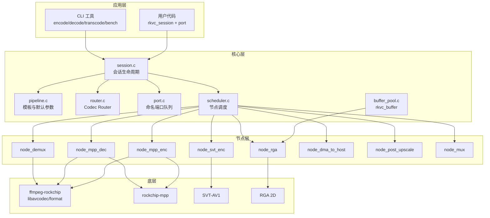

# 架构

rkvc v2 以 **Session** 为核心，将编解码流程建模为可配置的 **节点图**，由 **Codec Router** 按策略选择 H.264 / HEVC / AV1 路线。

## 模块关系



## Codec Router

`rkvc_route_resolve()` 根据 `rkvc_pipeline_desc` 中的 `policy`、`codec`、分辨率与帧率选择路线：

| policy | 默认路线 | 编码器 | 解码器 |
|--------|----------|--------|--------|
| `REALTIME` | H.264 RKMPP | `h264_rkmpp` | `h264_rkmpp` |
| `BALANCED` | HEVC RKMPP | `hevc_rkmpp` | `hevc_rkmpp` |
| `BALANCED`（1080p+ 且 ≥50fps） | H.264 RKMPP | `h264_rkmpp` | `h264_rkmpp` |
| `QUALITY` | AV1 | `svt-av1` (preset 11) | `av1_rkmpp` |

显式设置 `codec` 为 `H264` / `HEVC` / `AV1` 时跳过 policy 路由，强制对应编解码族。

## 管线模板

| 模板 | 用途 | 典型节点链 |
|------|------|------------|
| `FILE_ENCODE` | 原始 NV12 → 容器 | mux ← mpp/svt enc ← (rga 下采样) |
| `FILE_DECODE` | 容器 → 原始 NV12 | dma_to_host ← (post_upscale) ← mpp dec ← demux |
| `FILE_TRANSCODE` | 容器 → 容器 | mux ← enc ← (rga) ← mpp dec ← demux |
| `AV1_STORAGE` | AV1 存储档 | 强制 AV1 SVT + av1_rkmpp |
| `LIVE_CAPTURE` | 低延迟采集（占位） | V4L2 待接 |

## Session 端口

每个 Session 暴露三个命名端口，用于流式 push/pull：

| 端口 | 方向 | 数据类型 | 说明 |
|------|------|----------|------|
| `capture` | 输入 | `RKVC_BUF_VIDEO` | 采集/原始帧入口 |
| `output` | 输出 | `RKVC_BUF_VIDEO` 或 `RKVC_BUF_BITSTREAM` | 解码帧或编码码流 |
| `preview` | 输出 | `RKVC_BUF_VIDEO` | 预览支路（部分模板） |

文件模式通过 `rkvc_session_run_file()` 阻塞跑完整条管线，无需手动操作端口。

## 缓冲区生命周期

1. **分配**: `rkvc_buffer_alloc_video_host()` 创建主机 NV12 帧，或 `rkvc_buffer_alloc_bitstream()` 包装码流
2. **上传**: 节点内部通过 `av_hwframe_transfer_data` 上传到 RKMPP DMA-BUF
3. **处理**: MPP / SVT 硬件或软件编码；RGA 负责下采样
4. **下载**: `node_dma_to_host` 将硬件帧拉回主机内存
5. **后处理**: `node_post_upscale` 经 `node_rga`（`importbuffer` → `imcheck` → `imresize`）还原分辨率；bench 上采样仍用 CPU swscale
6. **释放**: `rkvc_buffer_unref()` 引用计数归零时释放

## 下采样 + 后处理上采样

模拟「低分辨率编码 → 解码 → 上采样还原」管线：

```
全分辨率 REF → RGA 1/N 下采样 → 编码 → 解码 → RGA 上采样 → 输出
```

对应字段：`enc_scale_denom`（编码前下采样分母）、`post_upscale_algo`（`nearest` / `bilinear` / `bicubic`，RGA 硬件）。`width`/`height` 始终为显示/参考分辨率。

## RKMPP 解码器初始化

RKMPP 解码器在 `avcodec_open2()` 时自动创建硬件设备上下文，无需手动设置 `hw_device_ctx`。这是 ffmpeg-rockchip 的内部行为，与标准 FFmpeg hwaccel API 不同。
