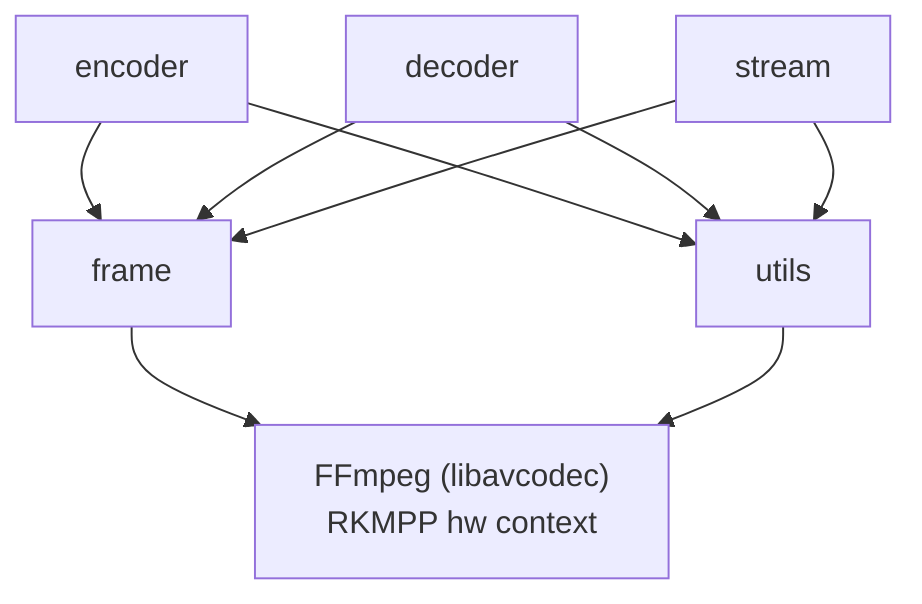

# 架构

## 模块关系

## 硬件帧生命周期

1. **分配**: `rkvc_frame_alloc()` 创建软件 NV12 帧
2. **上传**: `send_frame()` 通过 `av_hwframe_transfer_data` 上传到 RKMPP DMA buffer
3. **编码**: MPP 硬件编码器异步处理
4. **输出**: 编码后的 HEVC NAL 单元通过 `receive_packet()` 输出

## 解码器硬件初始化

RKMPP 解码器在 `avcodec_open2()` 时自动创建硬件设备上下文，无需手动设置 `hw_device_ctx`。这是 ffmpeg-rockchip 的内部行为，与标准 FFmpeg hwaccel API 不同。

## 流式 API 内部

流式 API 封装了编码器/解码器，提供：

- **阻塞式 push**: 编码器满时自动 drain + 重试
- **非阻塞 pull**: 立即返回可用结果
- **统计**: 跟踪帧数、帧率、延迟
