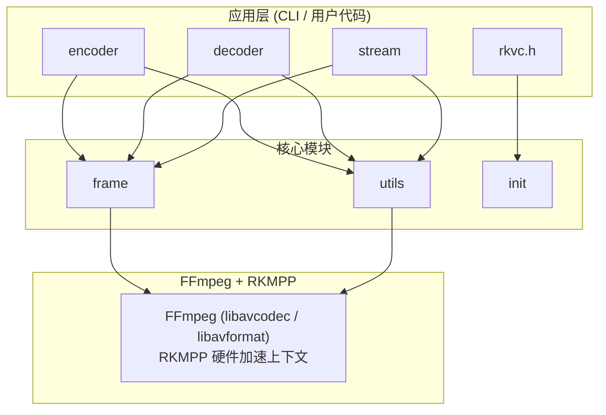

# rkvc 项目交付文档

> **项目名称**: rkvc (RK3588 Video Codec Library)
> **版本**: 0.1.0
> **目标硬件**: Rockchip RK3588
> **交付日期**: 2026 年 5 月 14 日

---

## 目录

1. [项目概述](#1-项目概述)
2. [功能特性](#2-功能特性)
3. [系统架构](#3-系统架构)
4. [环境要求与依赖](#4-环境要求与依赖)
5. [构建与安装](#5-构建与安装)
6. [打包与分发](#6-打包与分发)
7. [公共 API 参考](#7-公共-api-参考)
8. [CLI 工具使用手册](#8-cli-工具使用手册)
9. [示例程序](#9-示例程序)
10. [基准测试](#10-基准测试)
11. [项目源码结构](#11-项目源码结构)
12. [已知限制与注意事项](#12-已知限制与注意事项)
13. [故障排查](#13-故障排查)
14. [许可与第三方组件](#14-许可与第三方组件)
15. [测试与质量门禁](#15-测试与质量门禁)

---

## 1. 项目概述

rkvc 是一个面向 RK3588 平台的高性能 H.265 (HEVC) 硬件视频编解码 C 库。它基于 [ffmpeg-rockchip](https://github.com/nyanmisaka/ffmpeg-rockchip) 的 RKMPP (Rockchip Media Process Platform) 硬件加速能力，为上层应用提供简洁、易用的 C 语言 API。

### 核心价值

| 维度       | 说明                                                             |
| ---------- | ---------------------------------------------------------------- |
| **高性能** | 利用 RK3588 VPU 硬件编解码，1080p 编码 ~290 fps、解码 ~270 fps   |
| **低延迟** | 编码 ~7ms，端到端 ~76ms (P50)，满足实时监控需求                  |
| **零拷贝** | VPU 与 RGA 之间通过 DMA-BUF 零拷贝传递硬件帧                     |
| **易集成** | 纯 C11 接口，单头文件包含，支持 pkg-config 和 CMake find_package |
| **双模式** | 同时支持离线文件处理和实时流式处理                               |
| **可移植** | 提供自包含可移植包，解压即用，不依赖系统预装库                   |

### 适用场景

- 视频监控系统（实时编码、推流）
- 视频转码服务（文件批量转码）
- 嵌入式媒体处理（边缘计算设备）
- AI 视频前处理（编码/解码 + RGA 缩放/裁剪）

---

## 2. 功能特性

### 2.1 编码器

- H.265 (HEVC) RKMPP 硬件编码
- 支持最高 8K 分辨率
- 异步编码，回调式输出
- 可配置参数：
  - 分辨率、帧率、码率
  - 码率控制模式：CBR / VBR / CQP
  - 编码预设：FAST / MEDIUM / SLOW
  - GOP 大小、B 帧数量、HEVC Profile/Level
- 自动 muxer（根据输出文件扩展名选择 .h265 / .mp4 / .mkv）

### 2.2 解码器

- H.265 (HEVC) RKMPP 硬件解码
- 支持 8K 10-bit 解码
- 自动 demuxer，按帧读取
- 支持低延迟模式
- 自动探测流信息

### 2.3 流式 API

- 面向实时场景的 push/pull 异步管线
- 内部环形缓冲区，支持多线程生产者-消费者模式
- 内置帧率控制和丢帧策略
- 可配置缓冲帧数
- 内置帧率、延迟等统计信息

### 2.4 帧管理

- 引用计数生命周期管理
- 支持像素格式：NV12（VPU 原生）、YUV420P、NV16、P010 (10-bit)
- 提供平面数据指针访问接口
- 硬件帧自动 DMA-BUF 管理

### 2.5 CLI 工具

| 工具          | 功能                                         |
| ------------- | -------------------------------------------- |
| `rkvc_encode` | 离线/流式 H.265 编码，支持 stdin/stdout 管道 |
| `rkvc_decode` | 离线/流式 H.265 解码，支持 stdin/stdout 管道 |
| `rkvc_info`   | 硬件能力查询（文本/JSON 输出）               |
| `rkvc_bench`  | 编解码基准测试工具                           |

---

## 3. 系统架构

### 3.1 模块关系



### 3.2 硬件帧生命周期

```
1. 分配    rkvc_frame_alloc()       → 创建软件 NV12 帧
2. 填充    rkvc_frame_get_data()    → 获取像素数据指针，写入像素
3. 上传    send_frame()             → av_hwframe_transfer_data 上传到 RKMPP DMA buffer
4. 编码    MPP 硬件编码器            → 异步硬件编码
5. 输出    receive_packet()          → 取出 HEVC NAL 单元
```

### 3.3 解码流程

```
1. 打开    rkvc_decoder_open_file() → 自动创建 demuxer，探测流信息
2. 读取    rkvc_decoder_read_packet() → 从文件读取一包压缩数据
3. 解码    RKMPP 硬件解码器          → 自动创建硬件设备上下文
4. 输出    rkvc_decoder_receive_frame() → 取出解码帧（DMA-BUF 硬件表面）
5. 释放    rkvc_frame_unref()       → 引用计数归零时自动释放
```

### 3.4 流式 API 内部机制

- **阻塞式 push**: 编码器满时自动 drain + 重试
- **非阻塞 pull**: 立即返回可用结果，超时可配置
- **丢帧策略**: 缓冲满时可选择丢弃最旧帧
- **统计**: 内部跟踪帧数、帧率、延迟

---

## 4. 环境要求与依赖

### 4.1 硬件要求

| 组件 | 要求                           |
| ---- | ------------------------------ |
| SoC  | Rockchip RK3588 / RK3588S      |
| 内存 | >= 2 GB（推荐 4 GB+）          |
| 存储 | >= 100 MB 可用空间（构建产物） |

### 4.2 软件依赖

| 依赖              | 版本要求    | 说明                             |
| ----------------- | ----------- | -------------------------------- |
| Rockchip BSP 内核 | 5.10 或 6.1 | 提供 VPU 驱动                    |
| ffmpeg-rockchip   | 源码子模块  | RKMPP 硬件加速的 FFmpeg 分支     |
| rockchip-mpp      | 源码子模块  | Media Process Platform，静态链接 |
| libdrm-dev        | 系统包      | DRM/KMS 接口                     |
| patchelf          | 系统包      | 可移植包 RPATH 设置              |
| CMake             | >= 3.16     | 构建系统                         |
| Ninja             | 推荐        | 构建加速                         |
| GCC / Clang       | C11 支持    | 编译器                           |
| CMocka            | 可选        | 单元测试框架                     |

### 4.3 设备权限

运行前需确保以下设备节点可访问：

```bash
sudo chmod 666 /dev/mpp_service    # MPP 设备
sudo chmod 666 /dev/dma_heap       # DMA-BUF 堆
sudo chmod 666 /dev/rga            # RGA 2D 加速
sudo chmod 666 /dev/dri/*          # DRM 设备
```

也可通过 udev 规则永久设置：

```bash
# /etc/udev/rules.d/99-rk3588.rules
SUBSYSTEM=="misc", KERNEL=="mpp_service", MODE="0666"
SUBSYSTEM=="dma_heap", MODE="0666"
SUBSYSTEM=="char", KERNEL=="rga", MODE="0666"
SUBSYSTEM=="drm", MODE="0666"
```

---

## 5. 构建与安装

### 5.1 获取源码

```bash
git clone --recursive <repo-url> rk3588-ai-video-codec
cd rk3588-ai-video-codec

# 如果未使用 --recursive，需手动初始化子模块
git submodule update --init --depth 1
```

### 5.2 使用 CMake Presets 构建（推荐）

```bash
# 配置（Release 模式，Ninja 构建）
cmake --preset default

# 构建全部目标
cmake --build build

# 或仅构建指定目标
cmake --build build --target rkvc_shared    # 仅共享库
cmake --build build --target rkvc_static    # 仅静态库
cmake --build build --target rkvc_bench     # 仅基准测试工具
```

### 5.3 手动构建

```bash
git submodule update --init --depth 1
cmake -B build -G Ninja -DCMAKE_BUILD_TYPE=Release
ninja -C build
```

### 5.4 CMake 构建选项

| 选项                          | 默认值 | 说明                            |
| ----------------------------- | ------ | ------------------------------- |
| `RKVC_BUILD_SHARED`           | ON     | 构建共享库 (librkvc.so)         |
| `RKVC_BUILD_STATIC`           | ON     | 构建静态库 (librkvc.a)          |
| `RKVC_BUILD_EXAMPLES`         | ON     | 构建示例程序                    |
| `RKVC_BUILD_TOOLS`            | ON     | 构建 CLI 工具                   |
| `RKVC_BUILD_TESTS`            | OFF    | 构建单元测试                    |
| `RKVC_ENABLE_ASAN`            | OFF    | 启用 AddressSanitizer           |
| `RKVC_ENABLE_UBSAN`           | OFF    | 启用 UndefinedBehaviorSanitizer |
| `RKVC_ENABLE_COVERAGE`        | OFF    | 启用 gcov 覆盖率插桩            |
| `RKVC_ENABLE_FAULT_INJECTION` | OFF    | 启用确定性测试故障注入钩子      |
| `RKVC_ENABLE_TIDY`            | OFF    | 启用 clang-tidy 检查            |
| `RKVC_BUILD_DOCS`             | OFF    | 构建 Doxygen API 文档           |
| `RKVC_INSTALL`                | ON     | 生成安装目标                    |

### 5.5 CMake Presets 说明

| Preset     | 说明                     | 构建目录          |
| ---------- | ------------------------ | ----------------- |
| `default`  | Release 模式，Ninja      | `build/`          |
| `debug`    | Debug 模式               | `build-debug/`    |
| `tidy`     | clang-tidy 静态分析      | `build-debug/`    |
| `tests`    | 单元测试 (Debug, CMocka) | `build-tests/`    |
| `asan`     | ASan + UBSan 测试        | `build-asan/`     |
| `coverage` | gcov 覆盖率测试          | `build-coverage/` |

### 5.6 安装

```bash
# 系统级安装（默认 /usr/local）
cmake --install build

# 自定义安装路径
cmake --install build --prefix /opt/rkvc

# 卸载
cat build/install_manifest.txt | xargs rm -f
```

### 5.7 验证安装

```bash
# 检查库文件
ls /usr/local/lib/librkvc*

# 检查头文件
ls /usr/local/include/rkvc/

# 检查 pkg-config
pkg-config --cflags --libs rkvc

# 运行硬件能力查询
rkvc_info
```

### 5.8 在项目中使用

#### 方式一：pkg-config

```bash
gcc -o myapp myapp.c $(pkg-config --cflags --libs rkvc)
```

#### 方式二：CMake find_package

```cmake
find_package(rkvc REQUIRED)
target_link_libraries(myapp PRIVATE rkvc::shared)  # 共享库
# 或
target_link_libraries(myapp PRIVATE rkvc::static)  # 静态库
```

---

## 6. 打包与分发

### 6.1 可移植包（推荐）

从源码构建，包含所有运行时依赖，解压即用：

```bash
# 确保子模块已初始化
git submodule update --init --depth 1

# 构建（自动编译 ffmpeg-rockchip + rkvc）
./scripts/package-portable.sh

# 测试可移植包
./scripts/test-portable.sh build/portable/rkvc-0.1.0-linux-aarch64-portable
```

**产物**: `rkvc-0.1.0-linux-aarch64-portable.tar.gz` (~7.4 MB)

**目录结构**:

```
rkvc-0.1.0-linux-aarch64-portable/
├── bin/                     # 可执行工具 (RPATH 自包含)
│   ├── rkvc_encode
│   ├── rkvc_decode
│   ├── rkvc_info
│   └── rkvc_bench
├── lib/                     # 动态库
│   ├── librkvc.so*          # rkvc 库
│   ├── libavcodec.so.60     # ffmpeg-rockchip
│   ├── libavformat.so.60
│   ├── libavutil.so.58
│   └── ...                  # 仅包含实际使用的库
├── include/rkvc/            # 开发头文件
└── share/pkgconfig/rkvc.pc  # pkg-config
```

**使用方法**:

```bash
# 解压
tar xzf rkvc-0.1.0-linux-aarch64-portable.tar.gz
cd rkvc-0.1.0-linux-aarch64-portable

# 运行工具
./bin/rkvc_info
./bin/rkvc_encode --testsrc -o test.h265 -s 1920x1080 -n 100

# 二次开发
gcc -o myapp myapp.c -Iinclude -Llib -lrkvc
LD_LIBRARY_PATH=lib ./myapp
```

**可复现性保证**:

- ffmpeg-rockchip: 从 `third_party/ffmpeg-rockchip/` 子模块源码构建
- rockchip-mpp: 从 `third_party/mpp/` 子模块源码构建，静态链接进 librkvc
- rkvc: 从项目源码构建
- 不依赖系统预装的任何库

### 6.2 DEB 包

适用于系统级安装：

```bash
# 构建
cmake -B build -G Ninja -DCMAKE_BUILD_TYPE=Release
ninja -C build package

# 安装
sudo dpkg -i build/packages/rkvc_0.1.0_arm64.deb
```

> **注意**: DEB 包依赖系统上的 ffmpeg-rockchip 和 librockchip-mpp（rockchip-mpp 从 `third_party/mpp/` 源码构建）。

### 6.3 CPack TGZ

开发者 SDK 包（不含 ffmpeg 依赖）：

```bash
ninja -C build package
# 产物: build/packages/rkvc-0.1.0-Linux.tar.gz
```

### 6.4 打包脚本汇总

| 脚本                                  | 用途                      |
| ------------------------------------- | ------------------------- |
| `scripts/package-portable.sh`         | 从源码构建可移植包        |
| `scripts/package-portable.sh --clean` | 清理后重建                |
| `scripts/test-portable.sh <dir>`      | 测试可移植包（23 项验证） |

---

## 7. 公共 API 参考

### 7.1 头文件结构

```c
#include "rkvc/rkvc.h"    // 主入口，包含以下所有子头文件
// 或按需包含:
#include "rkvc/types.h"   // 错误码、像素格式、配置结构
#include "rkvc/frame.h"   // 帧管理
#include "rkvc/encoder.h" // H.265 编码器
#include "rkvc/decoder.h" // H.265 解码器
#include "rkvc/stream.h"  // 实时流式处理
```

### 7.2 全局初始化与清理

```c
rkvc_err rkvc_init(void);       // 初始化全局资源（线程安全，可多次调用）
void     rkvc_deinit(void);     // 释放全局资源
```

### 7.3 版本与能力查询

```c
const char *rkvc_version(void);          // 返回版本字符串，如 "0.1.0"
uint32_t    rkvc_version_number(void);   // 返回 major<<16 | minor<<8 | patch

// 运行时能力查询
rkvc_caps caps;
rkvc_query_caps(&caps);
// caps.has_rkmpp_enc, caps.has_rkmpp_dec, caps.has_dma_heap
// caps.has_rga, caps.max_width, caps.max_height
```

### 7.4 错误处理

所有函数返回 `rkvc_err` 枚举：

| 错误码               | 值  | 含义                       |
| -------------------- | --- | -------------------------- |
| `RKVC_OK`            | 0   | 成功                       |
| `RKVC_ERR_NOMEM`     | -1  | 内存分配失败               |
| `RKVC_ERR_INVALID`   | -2  | 参数无效                   |
| `RKVC_ERR_NOT_FOUND` | -3  | 编解码器或设备未找到       |
| `RKVC_ERR_IO`        | -4  | I/O 错误                   |
| `RKVC_ERR_HW`        | -5  | 硬件加速初始化失败         |
| `RKVC_ERR_EOF`       | -6  | 流结束                     |
| `RKVC_ERR_AGAIN`     | -7  | 需要更多输入或输出缓冲区满 |
| `RKVC_ERR_MUX`       | -8  | 封装器错误                 |
| `RKVC_ERR_INTERNAL`  | -9  | 内部 FFmpeg 错误           |

```c
const char *rkvc_err_str(rkvc_err err);  // 错误码转可读字符串
```

### 7.5 像素格式

| 格式                   | 枚举值 | 说明                       |
| ---------------------- | ------ | -------------------------- |
| `RKVC_PIX_FMT_NV12`    | 0      | NV12（默认，VPU 原生格式） |
| `RKVC_PIX_FMT_YUV420P` | 1      | YUV420P planar             |
| `RKVC_PIX_FMT_NV16`    | 2      | NV16 (4:2:2 semi-planar)   |
| `RKVC_PIX_FMT_P010`    | 3      | P010 (10-bit 4:2:0)        |

### 7.6 帧管理 API

```c
// 帧元数据（只读）
typedef struct {
    int            width;
    int            height;
    rkvc_pix_fmt   format;
    int64_t        pts;        // presentation timestamp
    int            key_frame;
} rkvc_frame_info;

// 帧生命周期
rkvc_err  rkvc_frame_alloc(rkvc_frame **out, int width, int height,
                           rkvc_pix_fmt format);
rkvc_err  rkvc_frame_get_info(const rkvc_frame *f, rkvc_frame_info *info);
rkvc_err  rkvc_frame_get_data(const rkvc_frame *f,
                              uint8_t *planes[4], int strides[4]);
rkvc_err  rkvc_frame_set_pts(rkvc_frame *f, int64_t pts);
rkvc_frame *rkvc_frame_ref(rkvc_frame *f);    // 引用计数 +1
void        rkvc_frame_unref(rkvc_frame *f);   // 引用计数 -1
```

**使用示例**:

```c
rkvc_frame *f = NULL;
rkvc_frame_alloc(&f, 1920, 1080, RKVC_PIX_FMT_NV12);

// 获取像素数据指针
uint8_t *planes[4];
int strides[4];
rkvc_frame_get_data(f, planes, strides);
// planes[0] = Y 平面, strides[0] = Y 行跨度
// planes[1] = UV 平面, strides[1] = UV 行跨度

rkvc_frame_set_pts(f, 0);
// ... 使用帧 ...
rkvc_frame_unref(f);
```

### 7.7 编码器 API

#### 配置结构

```c
typedef struct {
    int            width;           // 视频宽度（必填）
    int            height;          // 视频高度（必填）
    int            fps_num;         // 帧率分子（默认 30）
    int            fps_den;         // 帧率分母（默认 1）
    int64_t        bitrate;         // 目标码率 bps（默认 4 Mbps）
    int            gop_size;        // GOP 大小（默认 60）
    rkvc_pix_fmt   input_format;    // 输入像素格式（默认 NV12）
    rkvc_preset    preset;          // 编码预设（默认 MEDIUM）
    rkvc_rc_mode   rc_mode;         // 码率控制（默认 CBR）
    int            qp;              // CQP 模式下的 QP 值（默认 26）
    int            profile;         // HEVC profile（0=自动）
    int            level;           // HEVC level（0=自动）
    int            num_b_frames;    // B 帧数量（默认 0）
    int            threads;         // 线程数（默认 0=自动）
} rkvc_encoder_config;

rkvc_encoder_config rkvc_encoder_config_defaults(void);
```

#### 码率控制模式

| 模式       | 枚举值 | 说明     |
| ---------- | ------ | -------- |
| `RKRC_CBR` | 0      | 恒定码率 |
| `RKRC_VBR` | 1      | 可变码率 |
| `RKRC_CQP` | 2      | 恒定 QP  |

#### 编码预设

| 预设                 | 枚举值 | 说明     |
| -------------------- | ------ | -------- |
| `RKVC_PRESET_FAST`   | 0      | 速度优先 |
| `RKVC_PRESET_MEDIUM` | 1      | 均衡     |
| `RKVC_PRESET_SLOW`   | 2      | 质量优先 |

#### 编码包结构

```c
typedef struct {
    const uint8_t *data;     // 编码数据指针（仅在 receive 后有效）
    int            size;     // 数据大小
    int64_t        pts;      // 显示时间戳
    int64_t        dts;      // 解码时间戳
    int            key_frame; // 是否为关键帧
    int64_t        pos;      // 字节位置（文件模式）
} rkvc_packet;
```

#### 编码器生命周期函数

```c
// 打开（无文件输出，通过 receive_packet 获取数据）
rkvc_err rkvc_encoder_open(rkvc_encoder **out,
                           const rkvc_encoder_config *cfg);

// 打开（直接输出到文件，自动 muxer）
rkvc_err rkvc_encoder_open_file(rkvc_encoder **out,
                                const rkvc_encoder_config *cfg,
                                const char *output_path);

// 送入帧（调用后引用被编码器接管）
rkvc_err rkvc_encoder_send_frame(rkvc_encoder *enc, rkvc_frame *f);

// 送入原始像素缓冲区（快捷接口）
rkvc_err rkvc_encoder_send_buffer(rkvc_encoder *enc,
                                  const uint8_t *data, int linesize,
                                  int64_t pts);

// 取出编码包
rkvc_err rkvc_encoder_receive_packet(rkvc_encoder *enc, rkvc_packet *pkt);

// Drain: flush 所有缓冲帧
rkvc_err rkvc_encoder_drain(rkvc_encoder *enc);

// 关闭并释放
rkvc_err rkvc_encoder_close(rkvc_encoder *enc);
```

### 7.8 解码器 API

#### 配置结构

```c
typedef struct {
    rkvc_pix_fmt   output_format;  // 期望输出像素格式（默认 NV12）
    int            threads;        // 线程数（默认 0=自动）
    int            low_delay;      // 低延迟模式（默认 0）
} rkvc_decoder_config;

rkvc_decoder_config rkvc_decoder_config_defaults(void);
```

#### 解码器生命周期函数

```c
// 打开（无文件输入，手动 send_packet）
rkvc_err rkvc_decoder_open(rkvc_decoder **out,
                           const rkvc_decoder_config *cfg);

// 打开（从文件读取，自动 demuxer）
rkvc_err rkvc_decoder_open_file(rkvc_decoder **out,
                                const rkvc_decoder_config *cfg,
                                const char *input_path);

// 送入压缩数据包（流模式）
rkvc_err rkvc_decoder_send_packet(rkvc_decoder *dec,
                                  const uint8_t *data, int size,
                                  int64_t pts, int64_t dts);

// 从文件读取下一包（文件模式）
rkvc_err rkvc_decoder_read_packet(rkvc_decoder *dec);

// 取出解码帧
rkvc_err rkvc_decoder_receive_frame(rkvc_decoder *dec, rkvc_frame **f);

// Drain
rkvc_err rkvc_decoder_drain(rkvc_decoder *dec);

// 关闭并释放
rkvc_err rkvc_decoder_close(rkvc_decoder *dec);
```

### 7.9 流式 API

#### 流方向

| 方向                 | 枚举值 | 说明            |
| -------------------- | ------ | --------------- |
| `RKVC_STREAM_ENCODE` | 0      | 原始帧 → 压缩包 |
| `RKVC_STREAM_DECODE` | 1      | 压缩包 → 原始帧 |

#### 配置结构

```c
typedef struct {
    rkvc_stream_dir direction;      // 流方向（必填）

    // 编码参数
    int             width;          // 输入帧宽度
    int             height;         // 输入帧高度
    int             fps_num;        // 帧率分子（默认 30）
    int             fps_den;        // 帧率分母（默认 1）
    int64_t         bitrate;        // 目标码率 bps（默认 4M）
    rkvc_pix_fmt    input_format;   // 输入像素格式（默认 NV12）
    rkvc_preset     preset;         // 编码预设

    // 解码参数
    rkvc_pix_fmt    output_format;  // 输出像素格式（默认 NV12）

    // 通用参数
    int             buffer_size;    // 内部缓冲帧数（默认 4）
    int             drop_frames;    // 缓冲满时是否丢帧（默认 0）
} rkvc_stream_config;
```

#### 流式 API 函数

```c
rkvc_err rkvc_stream_open(rkvc_stream **out,
                          const rkvc_stream_config *cfg);

// 推入数据（非阻塞，缓冲满返回 RKVC_ERR_AGAIN）
rkvc_err rkvc_stream_push(rkvc_stream *s, const void *data);

// 拉取结果（timeout_ms: -1 阻塞等待，0 立即返回）
rkvc_err rkvc_stream_pull(rkvc_stream *s, void *out, int timeout_ms);

// 通知不再有新输入
rkvc_err rkvc_stream_finish(rkvc_stream *s);

// 关闭并释放
rkvc_err rkvc_stream_close(rkvc_stream *s);
```

### 7.10 完整使用示例

#### 离线文件编码

```c
#include "rkvc/rkvc.h"

int main(void) {
    rkvc_init();

    rkvc_encoder *enc = NULL;
    rkvc_encoder_config cfg = rkvc_encoder_config_defaults();
    cfg.width = 1920;
    cfg.height = 1080;
    cfg.bitrate = 4000000;
    cfg.fps_num = 30;

    rkvc_err err = rkvc_encoder_open_file(&enc, &cfg, "output.h265");
    if (err != RKVC_OK) {
        fprintf(stderr, "打开编码器失败: %s\n", rkvc_err_str(err));
        return 1;
    }

    for (int i = 0; i < 300; i++) {
        rkvc_frame *f = NULL;
        rkvc_frame_alloc(&f, 1920, 1080, RKVC_PIX_FMT_NV12);
        rkvc_frame_set_pts(f, i);

        // 填充 NV12 像素数据 ...
        uint8_t *planes[4];
        int strides[4];
        rkvc_frame_get_data(f, planes, strides);
        // memset(planes[0], 0, strides[0] * 1080);  // Y
        // memset(planes[1], 128, strides[1] * 540);  // UV

        rkvc_encoder_send_frame(enc, f);
    }

    rkvc_encoder_close(enc);
    rkvc_deinit();
    return 0;
}
```

#### 实时流编码

```c
#include "rkvc/rkvc.h"

int main(void) {
    rkvc_init();

    rkvc_encoder *enc = NULL;
    rkvc_encoder_config cfg = rkvc_encoder_config_defaults();
    cfg.width = 1920;
    cfg.height = 1080;
    cfg.bitrate = 4000000;

    rkvc_encoder_open(&enc, &cfg);  // 无文件输出

    for (int i = 0; i < 100; i++) {
        rkvc_frame *f = NULL;
        rkvc_frame_alloc(&f, 1920, 1080, RKVC_PIX_FMT_NV12);
        rkvc_frame_set_pts(f, i);
        // 填充像素数据 ...

        rkvc_encoder_send_frame(enc, f);

        rkvc_packet pkt;
        while (rkvc_encoder_receive_packet(enc, &pkt) == RKVC_OK) {
            // 发送到网络或处理 pkt.data/pkt.size
        }
    }

    rkvc_encoder_close(enc);
    rkvc_deinit();
    return 0;
}
```

#### 离线文件解码

```c
#include "rkvc/rkvc.h"

int main(void) {
    rkvc_init();

    rkvc_decoder *dec = NULL;
    rkvc_decoder_open_file(&dec, &rkvc_decoder_config_defaults(), "input.h265");

    rkvc_frame *frame = NULL;
    int frame_count = 0;
    while (rkvc_decoder_read_packet(dec) == RKVC_OK) {
        while (rkvc_decoder_receive_frame(dec, &frame) == RKVC_OK) {
            frame_count++;
            rkvc_frame_info info;
            rkvc_frame_get_info(frame, &info);
            printf("帧 %d: %dx%d pts=%ld\n",
                   frame_count, info.width, info.height, info.pts);
            rkvc_frame_unref(frame);
        }
    }

    rkvc_decoder_close(dec);
    rkvc_deinit();
    return 0;
}
```

#### 流式编码

```c
#include "rkvc/rkvc.h"

int main(void) {
    rkvc_init();

    rkvc_stream *s = NULL;
    rkvc_stream_config scfg = rkvc_stream_config_defaults();
    scfg.direction = RKVC_STREAM_ENCODE;
    scfg.width = 1920;
    scfg.height = 1080;
    scfg.buffer_size = 4;

    rkvc_stream_open(&s, &scfg);

    // 生产者线程
    for (int i = 0; i < 100; i++) {
        rkvc_frame *f = NULL;
        rkvc_frame_alloc(&f, 1920, 1080, RKVC_PIX_FMT_NV12);
        rkvc_frame_set_pts(f, i);
        // 填充数据 ...
        rkvc_stream_push(s, f);
    }

    // 消费者线程
    rkvc_packet pkt;
    while (rkvc_stream_pull(s, &pkt, 100) == RKVC_OK) {
        // 处理 pkt
    }

    rkvc_stream_finish(s);
    rkvc_stream_close(s);
    rkvc_deinit();
    return 0;
}
```

---

## 8. CLI 工具使用手册

### 8.1 rkvc_encode

H.265 硬件编码工具。

**用法**:

```bash
rkvc_encode [选项]
```

**选项**:

| 选项           | 说明                           |
| -------------- | ------------------------------ |
| `-i <file>`    | 输入原始视频文件 (NV12)        |
| `-o <file>`    | 输出文件 (.h265 / .mp4 / .mkv) |
| `-s <WxH>`     | 分辨率（如 1920x1080）         |
| `-r <fps>`     | 帧率（默认 30）                |
| `-n <count>`   | 编码帧数                       |
| `-b <bitrate>` | 目标码率（如 4M、2000k）       |
| `--testsrc`    | 使用测试图案（无需输入文件）   |
| `--stdin`      | 从 stdin 读取原始数据          |
| `--stdout`     | 输出到 stdout（裸 H.265 流）   |

**示例**:

```bash
# 使用测试图案编码
rkvc_encode --testsrc -o test.h265 -s 1920x1080 -n 300

# 从文件编码
rkvc_encode -i raw.nv12 -o out.h265 -s 1920x1080 -b 4M

# stdin 管道输入
cat raw.nv12 | rkvc_encode --stdin -o out.h265 -s 1920x1080

# stdout 管道输出
rkvc_encode --testsrc --stdout -s 640x480 -n 30 > out.h265
```

### 8.2 rkvc_decode

H.265 硬件解码工具。

**用法**:

```bash
rkvc_decode [选项]
```

**选项**:

| 选项        | 说明                       |
| ----------- | -------------------------- |
| `-i <file>` | 输入 H.265 文件            |
| `-o <file>` | 输出解码后的 NV12 文件     |
| `--stdin`   | 从 stdin 读取压缩数据      |
| `--stdout`  | 输出到 stdout              |
| `-s <WxH>`  | 分辨率（stdin 模式时需要） |

**示例**:

```bash
# 离线文件解码
rkvc_decode -i out.h265 -o decoded.nv12

# stdin 管道输入
rkvc_decode --stdin -s 1920x1080 -o decoded.nv12 < out.h265

# stdout 管道输出
rkvc_decode --stdin --stdout -s 1920x1080 < out.h265 > decoded.nv12
```

### 8.3 管道组合

```bash
# 编码 → 解码 一步到位
rkvc_encode --testsrc --stdout -s 640x480 -n 30 | \
  rkvc_decode --stdin --stdout -s 640x480 > decoded.nv12

# 验证数据完整性
# 编码→解码数据量应等于 W*H*1.5*帧数
rkvc_encode --testsrc --stdout -s 640x480 -n 10 | \
  rkvc_decode --stdin --stdout -s 640x480 | wc -c
# 预期: 640*480*1.5*10 = 4608000
```

### 8.4 rkvc_info

硬件能力查询工具。

**用法**:

```bash
rkvc_info            # 文本输出
rkvc_info --json     # JSON 输出（适合脚本解析）
rkvc_info --version  # 仅显示版本号
```

**输出示例**:

```
RKVC Hardware Capabilities
==========================
RKMPP Encoder:  YES
RKMPP Decoder:  YES
DMA Heap:       YES
RGA:            YES
Max Resolution: 8192x8192
```

### 8.5 rkvc_bench

编解码基准测试工具。

**用法**:

```bash
rkvc_bench [选项]
```

**选项**:

| 选项            | 说明               |
| --------------- | ------------------ |
| `--quick`       | 快速测试（120 帧） |
| (无参数)        | 完整测试（300 帧） |
| `--4k`          | 4K 分辨率测试      |
| `--stream`      | 包含流式 API 测试  |
| `--encode-only` | 仅编码测试         |
| `-o <dir>`      | 指定输出目录       |

---

## 9. 示例程序

项目提供了 6 个示例程序，位于 `examples/` 目录：

| 示例     | 源文件                     | 功能                            |
| -------- | -------------------------- | ------------------------------- |
| 离线编码 | `examples/encode_file.c`   | 将原始 NV12 帧编码为 H.265 文件 |
| 离线解码 | `examples/decode_file.c`   | 将 H.265 文件解码为 NV12 帧     |
| 转码     | `examples/transcode.c`     | 编码→解码全流程                 |
| 流式编码 | `examples/stream_encode.c` | 流式 API 编码示例               |
| 流式解码 | `examples/stream_decode.c` | 流式 API 解码示例               |
| 延迟测试 | `examples/latency_test.c`  | 模拟摄像头端到端延迟测试        |
| PSNR 测试 | `examples/psnr_test.c`    | 端到端编解码质量 PSNR 测试      |

构建后位于 `build/` 目录：

```bash
# 运行示例
./build/example_encode_file
./build/example_decode_file
./build/example_transcode
./build/example_stream_encode
./build/example_stream_decode
./build/example_latency_test -l               # 低延迟模式
./build/example_latency_test -s 1280x720 -r 60 -l  # 自定义参数
./build/example_psnr_test -i input.h265       # 端到端 PSNR 测试
```

---

## 10. 基准测试

### 10.1 运行基准测试

```bash
cd build
./rkvc_bench --quick          # 快速测试 (120 帧)
./rkvc_bench                  # 完整测试 (300 帧)
./rkvc_bench --4k             # 4K 测试
./rkvc_bench --stream         # 包含流式 API 测试
./rkvc_bench --encode-only    # 仅编码测试
./rkvc_bench -o results/run1  # 指定输出目录
```

### 10.2 输出格式

结果以 TSV 格式写入 `summary.tsv`：

```
test         size         rate  frames  elapsed_s  fps    realtime  bpp     total_bytes
encode       1920x1080    30    120     0.394      304.7  10.16     0.0056  ...
decode       1920x1080    30    115     0.413      278.6  9.29      12.000  ...
stream_enc   1920x1080    30    118     0.548      215.3  7.18      0.0057  ...
```

### 10.3 RK3588 实测结果

| 测试       | 帧率     | 实时倍率 | 说明                |
| ---------- | -------- | -------- | ------------------- |
| H.265 编码 | ~290 fps | ~9.6x    | RKMPP 硬编码，1080p |
| H.265 解码 | ~270 fps | ~9.0x    | RKMPP 硬解码，1080p |
| 流式编码   | ~215 fps | ~7.2x    | 含 DMA 上传开销     |

> 测试环境: RK3588，1080p，30fps 内容

### 10.4 端到端延迟测试

`latency_test` 模拟摄像头实时采集，经编码 → 解码全链路，测量每帧端到端延迟。

```bash
cd build

# 低延迟模式 (推荐)
./example_latency_test -l

# 自定义参数
./example_latency_test -s 1280x720 -r 60 -n 600 -b 8000000 -l
```

输出包含逐帧延迟明细和统计摘要（平均、P50、P95、P99）。

**RK3588 延迟实测结果 (1080p, 低延迟模式)**:

| 指标 | 编码延迟 | 端到端延迟 |
| ---- | -------- | ---------- |
| 平均 | ~7 ms    | ~69 ms     |

### 10.5 端到端 PSNR 测试

`psnr_test` 对输入 H.265 文件执行完整的 编解码→编码→重放解码→逐帧PSNR比较 流水线，量化编解码质量损失。

```bash
cd build

# 基本用法 (默认 4Mbps)
./example_psnr_test -i input.h265

# 自定义码率和帧数限制
./example_psnr_test -i input.h265 -b 8000000 -n 100

# 逐帧 PSNR 明细
./example_psnr_test -i input.h265 -v
```

输出指标：Y/U/V 分量平均 PSNR、加权平均 PSNR、Y 分量最低帧 PSNR 及总耗时。
| P50  | ~7 ms    | ~76 ms     |
| P95  | ~8 ms    | ~84 ms     |
| 最大 | ~8 ms    | ~111 ms    |

- **编码延迟**: 采集帧生成到编码包输出，RKMPP 硬编码 ~7ms
- **端到端延迟**: 采集帧生成到解码帧输出，含编码器/解码器硬件流水线
- 帧 0 延迟偏高 (~110ms) 为解码器初始化开销，稳态帧在 56-82ms 交替

---

## 11. 项目源码结构

```
rk3588-ai-video-codec/
├── CMakeLists.txt              # 主构建配置
├── CMakePresets.json           # CMake Presets (default/debug/tidy)
├── Doxyfile.in                 # Doxygen 配置模板
├── LICENSE                     # 许可证
├── README.md                   # 项目说明
├── zensical.toml               # 项目配置
│
├── include/rkvc/               # 公共 API 头文件
│   ├── rkvc.h                  # 主入口（包含所有子头文件）
│   ├── types.h                 # 错误码、像素格式、配置结构
│   ├── frame.h                 # 帧管理
│   ├── encoder.h               # H.265 编码器
│   ├── decoder.h               # H.265 解码器
│   └── stream.h                # 实时流式处理
│
├── lib/                        # 库实现（内部）
│   ├── init.c                  # 全局初始化/清理
│   ├── frame.c                 # 帧管理实现
│   ├── encoder.c               # 编码器实现
│   ├── decoder.c               # 解码器实现
│   ├── stream.c                # 流式 API 实现
│   ├── utils.c                 # 工具函数
│   ├── internal.h              # 内部共享头文件
│   ├── rkvc-config.cmake.in    # CMake 包配置模板
│   └── rkvc.pc.in              # pkg-config 模板
│
├── tools/                      # CLI 工具
│   ├── rkvc_encode.c           # 编码工具
│   ├── rkvc_decode.c           # 解码工具
│   ├── rkvc_info.c             # 硬件能力查询
│   └── rkvc_bench.c            # 基准测试
│
├── examples/                   # 示例程序
│   ├── encode_file.c           # 离线编码示例
│   ├── decode_file.c           # 离线解码示例
│   ├── transcode.c             # 转码示例
│   ├── stream_encode.c         # 流式编码示例
│   ├── stream_decode.c         # 流式解码示例
│   └── latency_test.c          # 模拟摄像头端到端延迟测试
│
├── tests/                      # 单元测试
│   ├── test_frame.c            # 帧管理测试
│   ├── test_contracts.c        # 公共 API 契约和异常路径测试
│   ├── test_internal.c         # 内部映射/转换一致性测试
│   ├── test_fault_injection.c  # OOM 故障注入测试
│   └── test_types.c            # 类型定义测试
│
├── scripts/                    # 构建/打包脚本
│   ├── package-portable.sh     # 可移植包构建
│   ├── test-strict.sh          # 严格测试矩阵
│   └── test-portable.sh        # 可移植包测试
│
├── docs/                       # 文档
│   ├── index.md                # 文档首页
│   ├── getting-started.md      # 快速开始
│   ├── api.md                  # API 参考
│   ├── architecture.md         # 架构说明
│   ├── benchmark.md            # 基准测试
│   ├── packaging.md            # 打包与分发
│   └── delivery.md             # 本文档
│
└── third_party/                # 第三方依赖
    ├── ffmpeg-rockchip/        # FFmpeg RKMPP 分支（子模块）
    └── mpp/                    # Rockchip MPP（子模块）
```

---

## 12. 已知限制与注意事项

### 12.1 硬件限制

- 仅支持 RK3588 / RK3588S 芯片
- 编码最高支持 8K (7680x4320)，实际性能取决于散热和功耗
- 解码支持 8K 10-bit
- 不支持 H.264 硬件编解码（仅 H.265/HEVC）

### 12.2 API 限制

- 帧的引用计数必须正确管理，忘记 `rkvc_frame_unref()` 会导致内存泄漏
- `rkvc_encoder_send_frame()` 后帧的所有权转移给编码器，不应再访问
- 编码包数据指针仅在 `receive_packet()` 返回后到下一次调用前有效
- `rkvc_frame_alloc()` 创建的是软件帧，需要通过 `send_frame()` 上传到硬件

### 12.3 构建限制

- 可移植包构建需要在 aarch64 目标平台上进行（不支持交叉编译）
- 子模块使用 shallow clone 以减小体积
- FFmpeg 静态库存在循环依赖，链接时使用 `--start-group/--end-group`

### 12.4 性能注意事项

- 编码器满时自动 drain，可能导致延迟抖动
- 流式 API 的缓冲区大小影响内存占用和延迟
- 10-bit 编码（P010 格式）性能低于 8-bit（NV12）

---

## 13. 故障排查

### 13.1 常见错误

| 症状                 | 可能原因          | 解决方案                                     |
| -------------------- | ----------------- | -------------------------------------------- |
| `RKVC_ERR_HW`        | MPP 设备不可访问  | 检查 `/dev/mpp_service` 权限                 |
| `RKVC_ERR_NOT_FOUND` | 编解码器未安装    | 确认 ffmpeg-rockchip 正确编译                |
| `RKVC_ERR_IO`        | 输入/输出文件错误 | 检查文件路径和权限                           |
| `RKVC_ERR_NOMEM`     | 内存不足          | 降低分辨率或缓冲区大小                       |
| 编码输出为 0 字节    | 未正确 flush      | 确保调用 `rkvc_encoder_close()` 或 `drain()` |
| 解码输出全黑         | 输入数据格式错误  | 确认输入为正确的 H.265 流                    |

### 13.2 诊断步骤

```bash
# 1. 检查硬件能力
rkvc_info --json

# 2. 检查设备权限
ls -la /dev/mpp_service /dev/dma_heap /dev/rga

# 3. 运行快速基准测试
./rkvc_bench --quick

# 4. 检查依赖库
ldd librkvc.so

# 5. 查看完整错误信息
export RKVC_LOG_LEVEL=debug
```

---

## 14. 许可与第三方组件

### 14.1 项目许可

本项目使用自有许可证，详见 `LICENSE` 文件。

### 14.2 第三方组件

| 组件            | 许可                     | 位置                           |
| --------------- | ------------------------ | ------------------------------ |
| ffmpeg-rockchip | LGPLv2.1 / GPLv2 / GPLv3 | `third_party/ffmpeg-rockchip/` |
| Rockchip MPP    | Apache 2.0               | `third_party/mpp/`             |

### 14.3 许可证兼容性

- 可移植包包含 LGPL 编译的 ffmpeg-rockchip 动态库
- 静态链接 ffmpeg 的场景需注意 GPL 合规性
- 商业使用建议咨询法务团队

---

## 15. 测试与质量门禁

本项目按 SQLite 的测试哲学强化交付门禁：契约测试先行，异常路径必须可重复，动态分析和覆盖率用于反查测试集盲区，硬件链路单独留证。

### 15.1 自动化测试矩阵

| 矩阵         | 覆盖内容                                       | 命令                                                         |
| ------------ | ---------------------------------------------- | ------------------------------------------------------------ |
| 基线单元测试 | 类型、帧生命周期、API 契约、内部映射、OOM 注入 | `cmake --preset tests && cmake --build --preset tests`       |
| ASan/UBSan   | 越界、use-after-free、未定义行为               | `cmake --preset asan && cmake --build --preset asan`         |
| 覆盖率插桩   | gcov 覆盖率数据和测试盲区分析                  | `cmake --preset coverage && cmake --build --preset coverage` |
| 硬件集成     | RKMPP H.265 编码/解码文件往返                  | `ctest --preset tests -R test_hardware --output-on-failure`  |
| 严格模式     | 顺序运行全部矩阵，自动附加 Valgrind/gcovr      | `./scripts/test-strict.sh`                                   |
| 可移植包     | 二进制完整性、动态库依赖、CLI 功能、开发文件   | `./scripts/test-portable.sh <package-dir>`                   |

`RKVC_ENABLE_FAULT_INJECTION` 只在测试 preset 中打开，用于确定性模拟项目自有分配失败；Release/交付构建默认不包含测试钩子。`test_hardware` 会自动探测 RKMPP 设备节点，不可用时 CTest skip，RK3588 实机交付时必须实际通过。

### 15.2 关键客户交付最低要求

- `./scripts/test-strict.sh` 全部通过。
- 安装 Valgrind 的环境下，所有 `build-tests/test_*` 必须无泄漏、无越界、无未初始化读取。
- 安装 gcovr 的环境下，归档 `build-coverage/coverage/index.html` 和 `coverage.xml`；RK3588 实机门禁为 `RKVC_COVERAGE_MIN_LINE=80`、`RKVC_COVERAGE_MIN_BRANCH=70`。
- Valgrind 默认覆盖无硬件依赖的 `test_*`；如需审查第三方 RKMPP/FFmpeg 硬件栈，使用 `RKVC_VALGRIND_HARDWARE=1` 单独运行并留存外部库告警。
- 固定样本在 RK3588 实机完成编码、解码、stdin/stdout 管道和长时间 soak test。
- 留存 SoC 型号、内核版本、设备节点权限、FFmpeg/MPP 版本、输入/输出样本 SHA256、测试日志和包哈希。
- 每个缺陷修复必须附带回归测试；不能自动化复现的缺陷必须加入发布清单。

---

## 附录 A: 快速参考卡

### 初始化与清理

```c
rkvc_init();
// ... 使用 API ...
rkvc_deinit();
```

### 编码

```c
rkvc_encoder_config cfg = rkvc_encoder_config_defaults();
cfg.width = 1920; cfg.height = 1080;
rkvc_encoder *enc;
rkvc_encoder_open_file(&enc, &cfg, "out.h265");
rkvc_encoder_send_frame(enc, frame);
rkvc_encoder_close(enc);
```

### 解码

```c
rkvc_decoder *dec;
rkvc_decoder_open_file(&dec, &rkvc_decoder_config_defaults(), "in.h265");
rkvc_frame *f;
while (rkvc_decoder_read_packet(dec) == RKVC_OK)
    while (rkvc_decoder_receive_frame(dec, &f) == RKVC_OK)
        rkvc_frame_unref(f);
rkvc_decoder_close(dec);
```

### 错误检查

```c
rkvc_err err = some_function();
if (err != RKVC_OK) {
    fprintf(stderr, "错误: %s\n", rkvc_err_str(err));
}
```

### CLI 快速命令

```bash
rkvc_encode --testsrc -o test.h265 -s 1920x1080 -n 100
rkvc_decode -i test.h265 -o decoded.nv12
rkvc_encode --testsrc --stdout -s 640x480 -n 30 | rkvc_decode --stdin --stdout -s 640x480 | wc -c
```

---

*文档结束*
