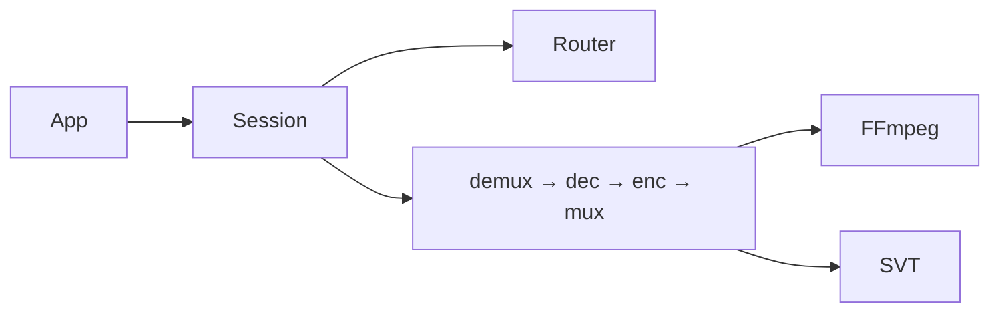

# rkvc 项目交付文档

> **项目名称**: rkvc (RK3588 Video Codec Library)  
> **版本**: 0.2.0  
> **目标硬件**: Rockchip RK3588 / RK3588S  
> **架构**: Session + Pipeline + Codec Router (v2)

---

## 目录

1. [项目概述](#1-项目概述)
2. [功能特性](#2-功能特性)
3. [系统架构](#3-系统架构)
4. [环境要求与依赖](#4-环境要求与依赖)
5. [构建与安装](#5-构建与安装)
6. [打包与分发](#6-打包与分发)
7. [公共 API 参考](#7-公共-api-参考)
8. [CLI 工具使用手册](#8-cli-工具使用手册)
9. [示例程序](#9-示例程序)
10. [基准测试](#10-基准测试)
11. [项目源码结构](#11-项目源码结构)
12. [已知限制与注意事项](#12-已知限制与注意事项)
13. [故障排查](#13-故障排查)
14. [许可与第三方组件](#14-许可与第三方组件)
15. [测试与质量门禁](#15-测试与质量门禁)
16. [v1 迁移](#16-v1-迁移)

---

## 1. 项目概述

rkvc 是面向 RK3588 平台的多码率视频编解码 C 库。v2 基于 [ffmpeg-rockchip](https://github.com/nyanmisaka/ffmpeg-rockchip) RKMPP 硬件加速与 SVT-AV1，通过 **Codec Router** 在 H.264 / HEVC / AV1 之间按策略自动选型。

### 核心价值

| 维度 | 说明 |
|------|------|
| **多码率** | REALTIME→H.264、BALANCED→HEVC、QUALITY→AV1 |
| **统一 API** | Session + 命名端口，文件/流式共用一套接口 |
| **零拷贝** | DMA-BUF 热路径，RGA 硬件缩放 |
| **易集成** | 纯 C11，pkg-config / CMake find_package |
| **可移植** | 自包含可移植包，含 ffmpeg-rockchip + MPP + SVT-AV1 |

### 适用场景

- 视频监控（低延迟 H.264 实时编码）
- 视频转码（多策略文件转码）
- 边缘 AI 前处理（编解码 + RGA 缩放）
- 码率-画质评估（RD 基准套件）

---

## 2. 功能特性

### 2.1 Codec Router

- `REALTIME` — H.264 RKMPP 硬编硬解，1080p E2E ~36fps
- `BALANCED` — HEVC RKMPP 硬编硬解，1080p E2E ~27fps
- `QUALITY` — SVT-AV1 软件编码 + `av1_rkmpp` 硬解，~24fps
- 显式 `codec` 强制覆盖 policy 路由

### 2.2 Session API

- 管线模板：编码、解码、转码、AV1 存储、LiveCapture（占位）
- 命名端口：`capture`、`output`、`preview`
- 文件模式：`rkvc_session_run_file()` 一键跑通
- 统计：`frames_in/out`、`avg_fps`、`route` 信息

### 2.3 Buffer 与缩放

- `rkvc_buffer` 统一视频帧（HOST/DMA-BUF）与码流
- RGA 硬件下采样（`enc_scale_denom`）
- swscale 传统上采样后处理（`post_upscale_algo`）

### 2.4 CLI 工具

| 工具 | 功能 |
|------|------|
| `rkvc_encode` | 原始 NV12 → MP4 |
| `rkvc_decode` | 容器 → 原始 NV12 |
| `rkvc_transcode` | 容器 → 容器（Router 选 codec） |
| `rkvc_info` | 多 codec 能力查询 |
| `rkvc_bench` | 三档 policy E2E fps 对比 |

---

## 3. 系统架构

详见 [架构文档](architecture.md)。



---

## 4. 环境要求与依赖

### 4.1 硬件

| 组件 | 要求 |
|------|------|
| SoC | RK3588 / RK3588S |
| 内存 | >= 2 GB（推荐 4 GB+） |

### 4.2 软件

| 依赖 | 说明 |
|------|------|
| Rockchip BSP 内核 | 5.10 或 6.1 |
| ffmpeg-rockchip | 子模块，`rebuild-ffmpeg-rkmpp.sh` |
| rockchip-mpp | 子模块 |
| SVT-AV1 | 子模块，`build-svt.sh` |
| libdrm-dev | 系统包 |
| patchelf | 可移植包打包 |
| CMake >= 3.21 | 构建系统 |

### 4.3 设备权限 {#设备权限}

```bash
sudo chmod 666 /dev/mpp_service /dev/dma_heap/* /dev/rga /dev/dri/*
```

udev 永久规则：

```
# /etc/udev/rules.d/99-rk3588.rules
SUBSYSTEM=="misc", KERNEL=="mpp_service", MODE="0666"
SUBSYSTEM=="dma_heap", MODE="0666"
SUBSYSTEM=="char", KERNEL=="rga", MODE="0666"
SUBSYSTEM=="drm", MODE="0666"
```

---

## 5. 构建与安装

```bash
git submodule update --init --depth 1
git submodule update --init --depth 1 third_party/SVT-AV1
./scripts/build-svt.sh
./scripts/rebuild-ffmpeg-rkmpp.sh

cmake --preset default
cmake --build --preset default
```

### CMake 构建选项

| 选项 | 默认 | 说明 |
|------|------|------|
| `RKVC_BUILD_SHARED` | ON | 共享库 |
| `RKVC_BUILD_STATIC` | ON | 静态库 |
| `RKVC_BUILD_EXAMPLES` | ON | 示例程序 |
| `RKVC_BUILD_TOOLS` | ON | CLI 工具 |
| `RKVC_BUILD_TESTS` | OFF | 单元测试 |
| `RKVC_ENABLE_FAULT_INJECTION` | OFF | 测试故障注入 |

### 安装

```bash
cmake --install build --prefix /usr/local
pkg-config --cflags --libs rkvc
```

---

## 6. 打包与分发

详见 [打包与分发](packaging.md)。

```bash
./scripts/package-portable.sh
./scripts/test-portable.sh build/portable/rkvc-0.2.0-linux-aarch64-portable
```

产物：`rkvc-0.2.0-linux-aarch64-portable.tar.gz`（约 4.5 MB，92 项自测）

---

## 7. 公共 API 参考

详见 [API 参考](api.md)。

```c
#include "rkvc/rkvc.h"

rkvc_init();
rkvc_pipeline_desc d;
rkvc_pipeline_from_template(RKVC_TEMPLATE_FILE_TRANSCODE, &d);
d.input_path = "in.mp4"; d.output_path = "out.mp4";
d.policy = RKVC_POLICY_BALANCED;

rkvc_session *s;
rkvc_session_create(&d, &s);
rkvc_session_run_file(s);
rkvc_session_destroy(s);
rkvc_deinit();
```

---

## 8. CLI 工具使用手册

### rkvc_encode

```bash
rkvc_encode -i raw.nv12 -o out.mp4 -s 1920x1080 \
  -p realtime|balanced|quality \
  -b 4000000 --rc-mode cbr \
  --enc-scale-denom 2 --post-upscale bilinear
```

- `-i` **必须**为原始 NV12 文件
- 无 `--testsrc` / `--stdin` / `--stdout`（v2 已移除）

### rkvc_decode

```bash
rkvc_decode -i input.mp4 -o decoded.nv12
```

### rkvc_transcode

```bash
rkvc_transcode -i in.mp4 -o out.mp4 -p balanced -b 4000000
```

### rkvc_info

```bash
rkvc_info -j    # JSON: h264_enc, hevc_enc, av1_enc, ...
```

### rkvc_bench

```bash
rkvc_bench -i sample.mp4 -o /tmp/bench -s 1920x1080
```

---

## 9. 示例程序

| 示例 | 功能 |
|------|------|
| `example_encode_file` | 测试图案 → MP4（端口 push 模式） |
| `example_decode_file` | 容器 → NV12 |
| `example_transcode` | 转码 |
| `example_stream_encode` | 流式编码 |
| `example_stream_decode` | 流式解码 |
| `example_stream_transcode` | 流式转码 |
| `example_stream_device_pair` | 双设备流（V4L2 占位） |
| `example_latency_test` | 端到端延迟 |
| `example_psnr_test` | PSNR 质量 |
| `example_decode_formats` | 多像素格式解码验证 |
| `example_visual_compare` | SDL2 可视化对比（可选） |

```bash
./build/example_encode_file -o test.mp4 -s 1920x1080 -n 100
./build/example_latency_test -l
```

---

## 10. 基准测试

详见 [基准测试](benchmark.md)。

```bash
./build/rkvc_bench -i clip.mp4
./scripts/run-bench.sh /path/to/1080p.mp4
```

---

## 11. 项目源码结构

```
rk3588-ai-video-codec/
├── include/rkvc/          # v2 公共头文件
│   ├── rkvc.h, types.h, buffer.h
│   ├── pipeline.h, policy.h, port.h, session.h
├── lib/                   # 实现
│   ├── session.c, pipeline.c, router.c, port.c
│   ├── node_*.c           # 管线节点
│   └── buffer_pool.c, scheduler.c, init.c
├── tools/                 # CLI
├── examples/              # 示例
├── tests/                 # CMocka 单元测试
├── bench/                 # RD 基准套件
├── scripts/               # 构建/打包/测试脚本
├── docs/                  # 文档
└── third_party/
    ├── ffmpeg-rockchip/
    ├── mpp/
    └── SVT-AV1/
```

---

## 12. 已知限制与注意事项

- 仅支持 RK3588 / RK3588S
- `LIVE_CAPTURE` 模板与 V4L2 采集尚未接入
- `rkvc_encode` 仅接受原始 NV12，不接受压缩码流
- `QUALITY` 策略依赖 SVT-AV1 软件编码，CPU 占用高于硬编
- 可移植包需在 aarch64 目标平台构建（不支持交叉编译）
- 网络 UDP/RTP 完整回环待 LiveCapture 接入后恢复

---

## 13. 故障排查

| 症状 | 可能原因 | 解决方案 |
|------|----------|----------|
| `RKVC_ERR_PERMISSION` | 设备权限不足 | 检查 `/dev/mpp_service`、`/dev/dma_heap/*`、`/dev/rga`、`/dev/dri/*` |
| `RKVC_ERR_FORMAT` | 输入格式不匹配 | 编码用原始 NV12；压缩文件走 decode/transcode |
| `RKVC_ERR_HW` | 硬件初始化失败 | `rkvc_info -j` 检查能力；确认 ffmpeg-rockchip 已重建 |
| `RKVC_ERR_NOT_FOUND` | 编解码器缺失 | 运行 `rebuild-ffmpeg-rkmpp.sh` 和 `build-svt.sh` |
| AV1 编码失败 | SVT 未构建 | `./scripts/build-svt.sh`；检查 `libSvtAv1Enc.so` |

```bash
rkvc_info -j
ls -la /dev/mpp_service /dev/dma_heap /dev/rga /dev/dri
./rkvc_bench -i tests/fixtures/sample.h264.mp4
export RKVC_LOG_LEVEL=debug
```

---

## 14. 许可与第三方组件

| 组件 | 许可 | 位置 |
|------|------|------|
| ffmpeg-rockchip | LGPLv2.1 / GPLv2 / GPLv3 | `third_party/ffmpeg-rockchip/` |
| Rockchip MPP | Apache 2.0 | `third_party/mpp/` |
| SVT-AV1 | BSD-3-Clause / PATENTS | `third_party/SVT-AV1/` |

---

## 15. 测试与质量门禁

详见 [测试](testing.md)。

```bash
./scripts/test-strict.sh
./scripts/test-portable.sh build/portable/rkvc-0.2.0-linux-aarch64-portable
```

- `tests` preset：13 个 CTest 目标
- 可移植包自测：92 项
- RK3588 实机：`RKVC_RUN_HARDWARE_TESTS=1 ctest -R test_session_`

---

## 16. v1 迁移

v0.1.x 的 `encoder`/`decoder`/`stream`/`frame` API 已在 0.2.0 移除。详见 [v1 → v2 迁移](migration.md)。

---

*文档结束*
